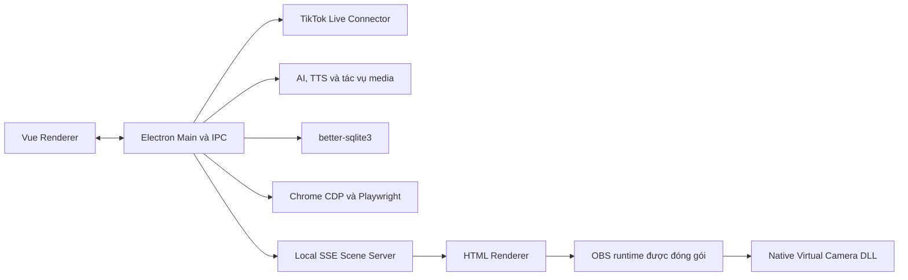
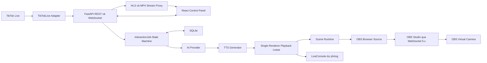
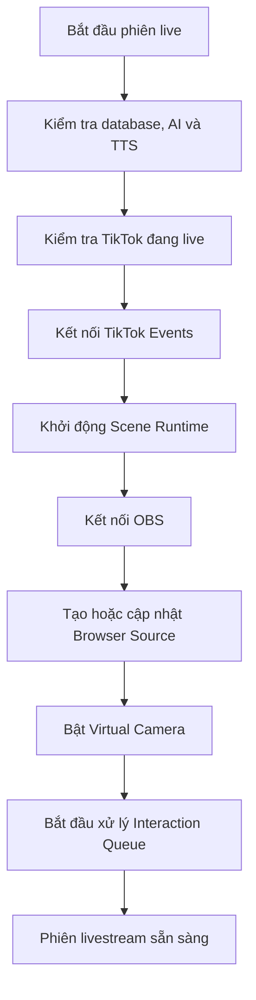

# Lộ trình phát triển LivestreamAgent AI

## 1. Định hướng sản phẩm

Phát triển ứng dụng thành **trung tâm điều khiển livestream chạy cục bộ quanh OBS**.

Hệ thống nên tập trung vào một pipeline ổn định:

```text
TikTok Event
    -> Trigger và bộ lọc
    -> Product Matching
    -> AI Response
    -> TTS Queue
    -> Scene Runtime
    -> OBS Browser Source
    -> Virtual Camera
```

Không nên tự xây một media engine mới hoặc sao chép native OBS/DLL riêng từ ứng dụng tham chiếu.

## 2. Hai sơ đồ kiến trúc để so sánh

### 2.1. Hệ thống tham chiếu LivestreamAgent 1.4.0



Đây là kiến trúc desktop tích hợp sâu: Electron điều phối phần lớn dịch vụ và gói kèm FFmpeg, OBS runtime cùng virtual-camera native. Nó mạnh nhưng chi phí đóng gói, cập nhật và bảo trì native cao; không nên sao chép các DLL hoặc package private của họ.

### 2.2. Hệ thống hiện tại của bạn và hướng mục tiêu



### 2.3. Kết luận so sánh

| Hạng mục | Hệ thống tham chiếu | Hệ thống của bạn | Quyết định |
|---|---|---|---|
| Desktop shell | Electron + Vue | React + FastAPI, Electron làm sau | Giữ backend tách rời để dễ kiểm thử |
| Điều phối backend | Electron Main/IPC | REST + WebSocket có contract rõ | Tiếp tục với FastAPI |
| Scene realtime | Local SSE renderer | Scene WebSocket hiện tại, snapshot/revision ở P1 | Không cần đổi framework ngay |
| Phát audio | Luồng nội bộ của desktop | `InteractionJob` + ACK từ renderer thật | Giữ một lease duy nhất |
| OBS/Virtual Camera | Gói runtime và DLL native | Dùng OBS cài ngoài + OBS WebSocket | Ít rủi ro bản quyền và bảo trì hơn |
| Xem luồng | HLS.js trong renderer | Backend proxy + `StreamViewer` | Đã phù hợp vai trò giám sát |

Hướng nên tiếp tục là **FastAPI làm control plane, Scene Runtime làm renderer, OBS làm media engine**. Không chuyển backend vào bundle Electron và không tự viết lại libobs ở giai đoạn này.

## 3. P0 — Hoàn thiện pipeline tương tác

Đây là ưu tiên cao nhất trước khi tiếp tục thêm nhiều màn hình.

### Công việc

- Chuẩn hóa một đối tượng `InteractionJob` dùng xuyên suốt hệ thống.
- Sử dụng state machine rõ ràng:

```text
received
    -> ai_processing
    -> queued
    -> tts_processing
    -> ready
    -> playing
    -> done
```

- Hỗ trợ các trạng thái lỗi:

```text
skipped | cancelled | error
```

- Giới hạn queue tối đa 100 job.
- Chỉ cho phép một audio phát tại một thời điểm.
- Hỗ trợ bỏ qua job hiện tại, xóa queue, thử lại và hủy request.
- Thêm timeout cho AI và TTS.
- Ghi event đầu vào để có thể replay khi kiểm thử.
- Ngăn listener bị đăng ký trùng sau reconnect.
- Bổ sung handler đầy đủ cho:
  - comment;
  - gift;
  - like;
  - follow;
  - share;
  - member/join;
  - disconnect;
  - live end.
- Gift combo chỉ được xử lý khi combo đã kết thúc.
- Lưu lý do mỗi comment được chấp nhận hoặc bị loại.

### Tiêu chí hoàn thành

- Chạy mô phỏng liên tục trong nhiều giờ mà không trùng event.
- Audio không phát chồng nhau.
- Một job lỗi không làm kẹt các job phía sau.
- Reconnect không làm tăng số listener.
- Có thể replay một file event và nhận cùng kết quả xử lý.

### Endpoint P0 đã triển khai

| Method | Endpoint | Vai trò |
|---|---|---|
| `POST` | `/api/interaction-jobs` | Nhận interaction thủ công/API và tạo job |
| `GET` | `/api/interaction-jobs` | Liệt kê job, lọc theo trạng thái |
| `GET` | `/api/interaction-jobs/{job_id}` | Xem toàn bộ vòng đời một job |
| `POST` | `/api/interaction-jobs/{job_id}/playback` | ACK `started`, `ended` hoặc `failed` |
| `POST` | `/api/interaction-jobs/{job_id}/cancel` | Hủy một job |
| `POST` | `/api/interaction-jobs/{job_id}/retry` | Thử lại job lỗi hoặc đã hủy |
| `GET` | `/api/interaction-queue` | Xem capacity, pending và active job |
| `POST` | `/api/interaction-queue/skip-current` | Dừng audio thật rồi bỏ job hiện tại |
| `POST` | `/api/interaction-queue/clear` | Xóa pending; mặc định không dừng active job |
| `WS` | `/ws/live` | Snapshot, trạng thái job và playback lease dự phòng |
| `WS` | `/ws/scene` | Playback lease chính và ACK gắn với đúng renderer |

Contract hiện bảo đảm:

- queue nhận tối đa 100 job chưa kết thúc;
- chỉ một kết nối renderer nhận `tts_play`;
- chỉ ACK có đúng `job_id`, `playback_id` và renderer lease mới được chấp nhận;
- `skip`, `cancel`, disconnect và timeout gửi `tts_stop` trước khi nhả job kế tiếp;
- ACK lặp của playback đã kết thúc là idempotent;
- TTS đang chạy bị hủy thật khi skip;
- lỗi AI, TTS, playback hoặc renderer không làm kẹt queue.

### Phần P0 còn lại

- Thêm `Idempotency-Key`, `source_event_id`, `correlation_id`, `attempt` và `version` vào job.
- Ghi raw event và endpoint replay fixture.
- Tách timeout chờ `started` khỏi thời lượng playback dài.
- Phục hồi `queued/ready` có kiểm soát sau restart; job đang `playing` phải thành `playback_interrupted`.
- Thêm màn hình queue inspector với nút skip, clear, cancel và retry.
- Chạy soak test nhiều giờ và test 100 request đồng thời.

## 4. P1 — Scene Runtime độc lập

Scene Runtime nên là một trình render HTML nhẹ, tách khỏi giao diện điều khiển React.

### Endpoint đề xuất

```text
GET  /scene
GET  /scene/events
GET  /scene/health
GET  /scene/assets/:id
POST /scene/ready
POST /scene/log
```

### Công việc

- Gửi full snapshot khi renderer kết nối hoặc reconnect.
- Gửi patch nhỏ cho các thay đổi tiếp theo.
- Mỗi snapshot/patch có `revision` tăng dần.
- Bỏ qua patch cũ hoặc sai thứ tự.
- Quản lý media bằng asset ID thay vì URL file tùy ý.
- Hỗ trợ các layer:
  - image;
  - GIF;
  - video;
  - text/caption;
  - avatar idle;
  - avatar talking.
- Avatar chuyển từ `idle` sang `talking` khi TTS bắt đầu.
- Avatar trở về `idle` khi audio kết thúc hoặc bị hủy.
- Không reload video/GIF khi chỉ thay đổi caption hoặc vị trí layer khác.

### Tiêu chí hoàn thành

- Scene trong Browser Source giống scene trong Avatar Studio.
- Thay đổi scene xuất hiện trong vòng khoảng 200 ms trên máy cục bộ.
- Reconnect luôn nhận lại đầy đủ trạng thái.
- Một thay đổi nhỏ không làm khởi động lại toàn bộ media.

## 5. P2 — Điều khiển OBS bằng WebSocket

Tạo một `OBSService` trong backend thay vì tích hợp trực tiếp native OBS.

### Chức năng cần có

- Kết nối tới OBS WebSocket 5.x.
- Hỗ trợ hostname, port và mật khẩu.
- Kiểm tra phiên bản OBS và RPC version.
- Tạo hoặc chọn scene `LivestreamAgent`.
- Tạo Browser Source nếu chưa tồn tại.
- Cập nhật URL của Browser Source nếu đã tồn tại.
- Đặt độ phân giải scene:
  - 1080 × 1920 cho video dọc;
  - 1920 × 1080 cho video ngang.
- Theo dõi trạng thái Browser Source và scene hiện hành.
- Bắt đầu/dừng Virtual Camera.
- Khôi phục kết nối khi OBS restart.
- Không xóa hoặc ghi đè scene của người dùng không thuộc ứng dụng.

### OBS WebSocket request cần dùng

```text
GetVersion
GetSceneList
CreateScene
GetInputList
CreateInput
GetInputSettings
SetInputSettings
GetVirtualCamStatus
StartVirtualCam
StopVirtualCam
```

### Tiêu chí hoàn thành

- Backend xác định chính xác OBS đang online hay offline.
- Ứng dụng tự tạo được scene và Browser Source.
- Browser Source hiển thị đúng Scene Runtime.
- Virtual Camera có thể bật/tắt từ giao diện.
- Restart OBS không yêu cầu restart toàn bộ backend.

## 6. P3 — Workflow “Bắt đầu phiên live”

Tạo một workflow duy nhất thay vì yêu cầu người dùng mở từng màn hình cấu hình.



### Yêu cầu

- Mỗi bước phải trả trạng thái machine-readable.
- Nếu thất bại, giao diện phải hiển thị đúng bước bị lỗi.
- Cho phép chạy lại riêng bước thất bại.
- Nút dừng phải hủy queue, đóng connector và dừng tài nguyên thuộc ứng dụng.
- Không tự động dừng hoặc xóa tài nguyên OBS không thuộc ứng dụng.

## 7. P4 — Projects, phục hồi và chẩn đoán

### Projects

- Mỗi cấu hình livestream được lưu thành một project.
- Project bao gồm:
  - TikTok room;
  - sản phẩm;
  - trigger;
  - AI provider và prompt;
  - TTS voice;
  - scene;
  - OBS settings;
  - shop schedule.
- Hỗ trợ tạo, đổi tên, nhân bản, import và export project.
- Có autosave và schema version.
- Backup trước khi migrate database.

### Chẩn đoán

Tạo health dashboard cho:

```text
TikTok
AI Provider
TTS
Interaction Queue
Stream Proxy
Scene Runtime
OBS
Virtual Camera
Database
Chrome/Playwright
```

### Logging

- Log có cấu trúc JSON.
- Có correlation ID cho từng `InteractionJob`.
- Che API key, cookie, token và URL ký số.
- Không ghi toàn bộ system prompt nếu không cần thiết.
- Hỗ trợ tìm kiếm, lọc và export log.

## 8. P5 — TikTok Shop Automation

Chỉ nên thực hiện sau khi pipeline livestream và OBS đã ổn định.

### Công việc

- Phát hiện Chrome hoặc Edge.
- Khởi chạy profile riêng với remote debugging.
- Người dùng tự đăng nhập; ứng dụng không thu thập mật khẩu.
- Kết nối Playwright qua CDP.
- Đọc danh sách sản phẩm với scrolling và deduplication.
- Ánh xạ sản phẩm TikTok Shop với catalog cục bộ.
- Ghim đúng một sản phẩm.
- Scheduler tuần tự hỗ trợ:
  - thời lượng;
  - retry;
  - pause/resume;
  - skip;
  - stop ngay lập tức.
- Chụp screenshot và log selector khi automation thất bại.

## 9. P6 — Đóng gói desktop

Chỉ đóng gói sau khi các chức năng chính chạy ổn định ở chế độ development.

### Hướng đề xuất

- React tiếp tục làm renderer.
- FastAPI tiếp tục làm backend cục bộ.
- Electron làm desktop shell và quản lý vòng đời backend.
- Backend Python có thể đóng gói thành executable riêng.
- Electron chờ endpoint `/api/health` sẵn sàng trước khi mở UI.
- Khi thoát ứng dụng, Electron dừng đúng process backend mà nó đã tạo.
- Không đóng gói OBS hoặc Chrome vào ứng dụng.

## 10. Phần xem luồng

`StreamViewer` nên được xem là màn hình giám sát, không phải lõi điều khiển livestream.

### Phần đã có

- Nhập URL HLS hoặc MP4.
- Backend kiểm tra URL nguồn.
- Proxy playlist và segment.
- Viết lại URL trong playlist HLS.
- Hỗ trợ HTTP Range.
- Phát bằng HLS.js hoặc HTML video.
- Đồng bộ trạng thái qua WebSocket.

### Phần nên bổ sung

- Token proxy có thời hạn.
- Xóa token cũ định kỳ.
- Giới hạn số kết nối đồng thời.
- Giới hạn băng thông proxy.
- Thống kê bitrate, buffer và độ trễ.
- Hiển thị quality level hiện tại.
- Cho phép chọn Auto/720p/1080p nếu playlist có nhiều variant.
- Tự phục hồi khi playlist hoặc segment lỗi tạm thời.
- Phân biệt rõ lỗi DNS, timeout, HTTP và codec.
- Không ghi URL nguồn chứa token vào log.

## 11. Thứ tự triển khai khuyến nghị

```text
1. InteractionJob và queue state machine
2. TikTok reconnect, event replay và gift combo
3. Scene Runtime có snapshot/revision
4. OBS WebSocket Service
5. Workflow Bắt đầu/Dừng phiên live
6. Project persistence và health dashboard
7. TikTok Shop automation
8. Desktop packaging
```

Nếu chỉ chọn một việc để làm tiếp, hãy hoàn thiện **Interaction Queue**, sau đó triển khai **OBS WebSocket**. Đây là hai phần giúp dự án chuyển từ bản demo nhiều màn hình thành một hệ thống livestream có thể vận hành thực tế.

## 12. Tài liệu tham khảo

- [TikTokLive](https://github.com/isaackogan/TikTokLive)
- [OBS WebSocket](https://github.com/obsproject/obs-websocket)
- [OBS WebSocket 5.x Protocol](https://raw.githubusercontent.com/obsproject/obs-websocket/master/docs/generated/protocol.md)
- [OBS Browser Source](https://obsproject.com/kb/browser-source)
- [OBS Virtual Camera Guide](https://obsproject.com/kb/virtual-camera-guide)
- [HLS.js](https://github.com/video-dev/hls.js/)
- [HLS.js API](https://github.com/video-dev/hls.js/blob/master/docs/API.md)
